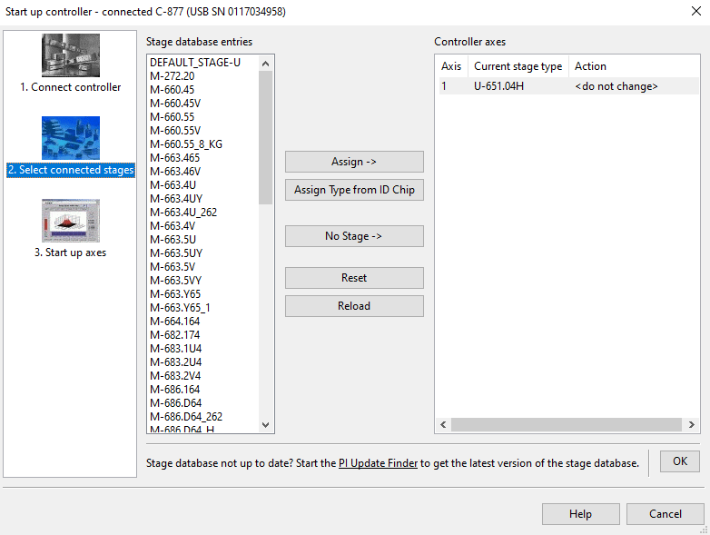

# Installing PI Drivers / Software
- Until 26 May 2020, you had to install all the drivers and software for the controller you have (f.e. C-877). That was done with a CD.
- From 26 May 2020 PI software is available online via the PI Software Suite. The PI Software Suite bundles the previously individually available applications into five software components. Details can be found in the PI Software Release News. These components can be updated with the PIUpdateFinder. The download of individual applications is no longer offered.
- Installing the PI Software Suite will delete all existing PI directories on your PC. If you still need old contents (e.g., samples, programming DLLs) saved in these directories, please save them before installing the PI Software Suite.
- you can download the PI software suite from here: https://www.pi-usa.us/en/products/software-suite
- if it works, use this link directly: https://update.pi-portal.ws/down.php?link=PI_C-990_CD1.zip&name=PI_C-990_CD1.zip&id=1
- in windows, you can directly use the device over the usb port, while the usb port communication is not natively working in linux

# Initializing the Device
## General Information
- To get an overview: You have a **controller** (connects to the pc) with its serialnumber. Then you have the positioner (that does the actual f.e. linear or rotational movement) which connects to the controller.
- The model of the controller should be known. It should be written on the controller like ('C-877.1U11') or you could also see it, under *Device Manager* in Windows. If you have only one controller connected, you can see the model in the PIMikroMove Software from the PI Software Suite (I will show how in a moment)
- The serialnumber of the controller starts with 'SN' and is a long number like '0117034958'. It should be written on the positioner. If not, you could look it up with PIMikroMove (I will show how in a moment)
- Then there are **stages**. Stages define a set of movements that a positioner can handle. Every controller can only handle a specific sets of stages. So you must ensure that your controller supports the stage your positioner needs.
- Every positioner supports some stages. You must know the stage your positioner can handle. The stage should either be known to you in the buying process (since there are devices that look exactly the same but have different stages) or you can read out the default stage that is written in the chip of the positioner (again with PIMikroMove)

## Reading Information
- Connect your controller and positioner according to the manual
- Start PIMikroMove. When starting, this window will prompt:

- We currently have only 1 controller connected and it is the 'C-877' controller that has the serialnumber '0117034958' as you can see.
- After clicking on *Connect*, click on *2. Select connected stages* on the left of the window

- You could choose a stage you want (be aware not choosing a stage your positioner doesn't support). If you want to use the default stage of your positioning positioner, clock on *Assign Type from ID Chip*
- Click on *OK* and go on with *3. Start up axes*

- Click on *Automatic* and go on with the instructions. 
- After finishing this, close the window. In the main Window of PIMikroMove you can now play around with your positioner and manually set some parameters.
- To use the python-code, note the modelnumber and serialnumber of the controller and the stage of the positioner.

## Running the testscript
- NOTE: This scripts are only programmed for the USB Connection of a device. Other alternatives would be over TCP/IP or Serial
- Firstly, install the required python package with `python3 -m pip install pipython==2.10.0.2`
- Open the `demo.py` file and type in the stage of the positioner and the model- and serialnumber of the controller.
- Then run the testscript by typing `python3 demo.py`

# Supported Devices
- U-651

# Linux
- On Linux, you can only use the device with the GCS LabVIEW driver set or you need to use WINE (Wine Is Not an Emulator)
- if you use WINE, you can use the TCP/IP connection, or if you have an FTDI USB implementation, a virtual COM port can be used
- USB is not possible natively
- if you will use a virtual COM port, see this instruction:
	1. Open "/home/<user>/.wine/system.reg". 
		- This is the configuration file for the HKEY_LOCAL_MACHINE key of the Windows registry file. The serial interfaces have to be added to the file, since PIMikroMove gets the available interfaces from this registry key.
	2. Add the serial interfaces.
		- Example:
			```
			Hardware\\Devicemap\\Serialcomm 1231984861
			"DeviceSerial0"="COM1"
			"DeviceSerial1"="COM2"
			"DeviceSerial2"="COM3 FTDI USB 1"
			"DeviceSerial3"="COM4 FTDI USB 2"
			```
		- The "DeviceSerialX" keys refer to the actual interfaces. Their values (the text following the = sign) determine by which name they are shown in the selection lists in PIMikroMove.
	3. Create the soft links to the actual devices, in /home/<user>/.wine/dosdevices.
		- For example:
			```
			ln -s /dev/ttyS0 /home/<user>/.wine/dosdevices/com1
			ln -s /dev/ttyS1 /home/<user>/.wine/dosdevices/com2
			ln -s /dev/ttyUSB0 /home/<user>/.wine/dosdevices/com3
			ln -s /dev/ttyUSB1 /home/<user>/.wine/dosdevices/com4
			```
		- The "comX" entries correspond to the "DeviceSerialX" keys.
- Note: Under Wine, the "baud rate scan" of the DLL does not work. This means that the baud rate set in the controller has to be used